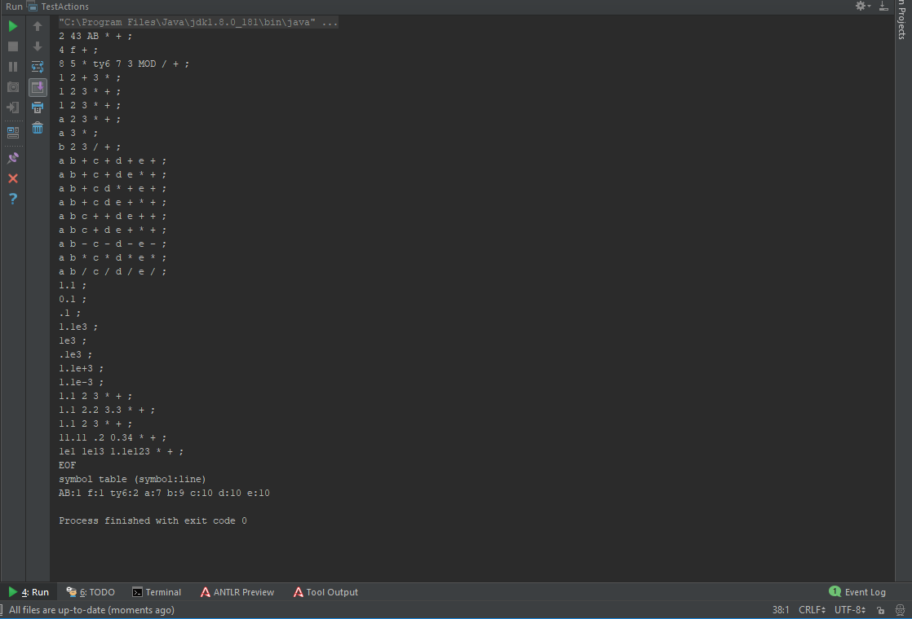
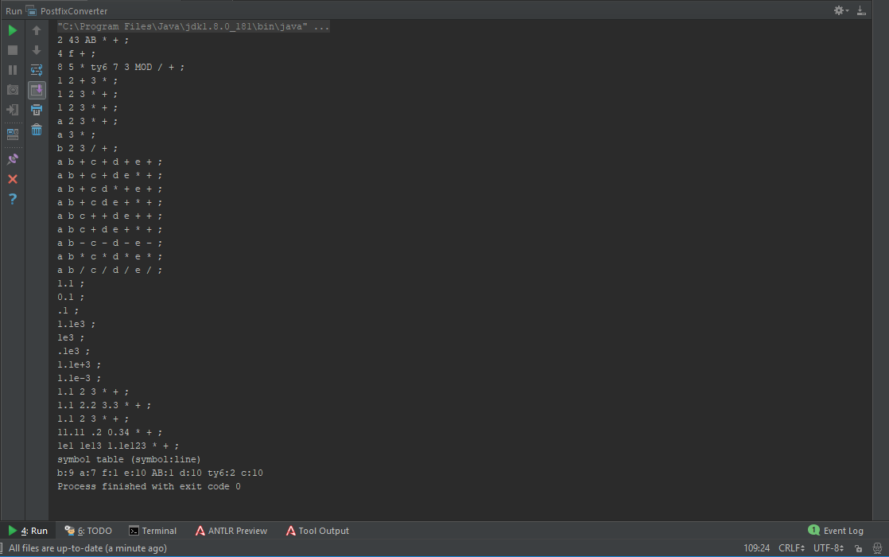
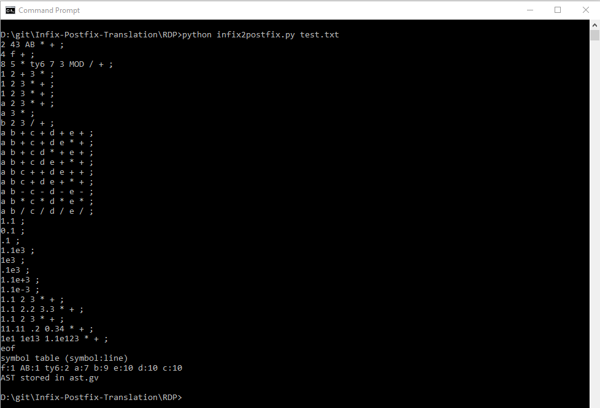
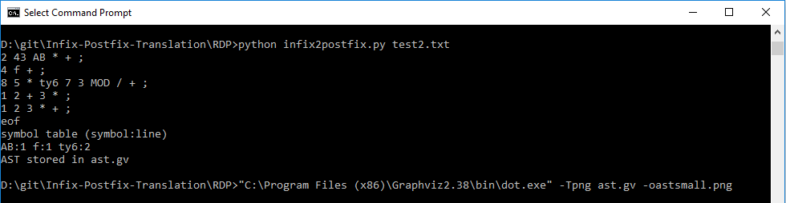
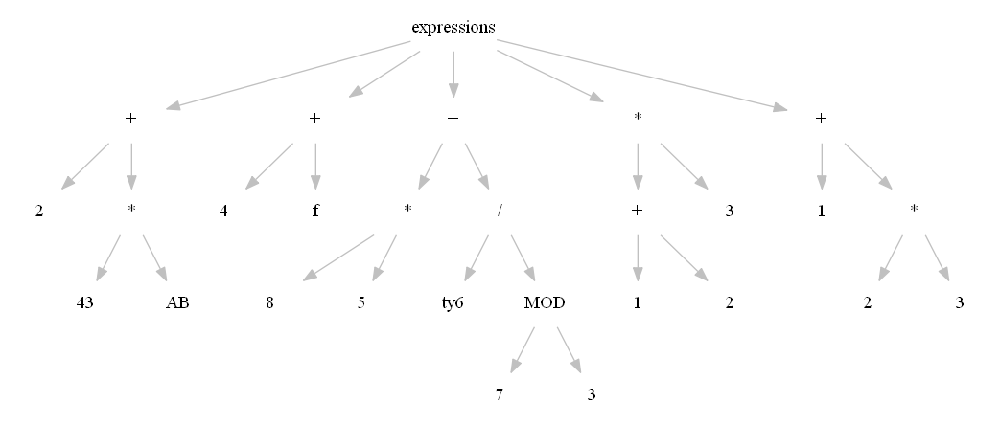

**A02 - Language Translation**

Student Info
=============

Your name: Edric Yu

Operating system: Windows 10

Lab computer or your own computer: my own

Did you receive help from your instructor? No

Implementations
================

ANTLR Actions
--------------------------------
It's pretty much just a transcribed version of the grammar rules.

The grammar is in `Infix2Postfix.g4`.
`TestActions.java` was made to run it. 

For extra credit, I changed the `NUM` rule to work for real numbers
including decimals and/or exponents, and I added two ArrayLists
to store the symbols and their line numbers

ANTLR Listener
--------------------------------
The grammar has actions removed and is in `Infix.g4`.
The `number` and `identifier` rules were added for easier
access to their enter and exit functions.

Most of the listener methods are 'exit' function in order to read the produced data.

Real numbers and symbol line numbers are also implemented here.
I actually used a HashTable this time.

The listener is named `PostfixConverter`. It is stored in `PostfixConverter.java` with
a main method that reads from `inputs/test.txt`.

RDP (Python)
--------------------------------
The lexer code from before was translated to Python and modified for this assignment.
Implementation was pretty straightforward.

It does some but not much checking for valid input.
The lexing process generally doesn't handle any errors,
so numbers indicating an exponent but not having one (e.g. `1e`, `2.3e+`, `.4e-`)
will be considered numbers.

Creating the abstract syntax tree was tackled in this section.
I first tried (and succeeded!) to create the tree without doing semantic analysis.
This was rather difficult and (as I realized later) unnecessary. The results of this
process can be seen in infix2postfix2.py

The proper implementation in infix2postfix.py of this uses 'evalstack' to pretend it's actually
calculating the generated postfix notation, but instead it creates the tree.
The tree is by default stored in a file named ast.gv

Here is the AST of the first 5 lines of the test file:

Full Test File
---------------------------------
Each of the implementations were validated with this test set.
~~~ plaintext linenumbers
2 + 43 * AB;  4 + f;
8 * 5 + ty6 / (7 MOD
3);
(1+2)*3;
1 + (2 * 3);
1 + 2 * 3;
a + 2 * 3;
a * 3;
b + 2 / 3;
a + b + c + d + e;
a + b + c + d * e;
a + b + c * d + e;
a + b + c * (d + e);
a + (b + c) + (d + e);
a + (b + c) * (d + e);
a - b - c - d - e;
a * b * c * d * e;
a / b / c / d / e;

1.1;
0.1;
.1;
1.1e3;
1e3;
.1e3;
1.1e+3;
1.1e-3;

1.1 + 2 * 3;
1.1 + 2.2 * 3.3;
1.1 + 2 * 3;
11.11 + .2 * 0.34;
1e1 + 1e13 * 1.1e123;

~~~

Assignment Reflection
======================

Hours to complete assignment: ~6

I enjoyed this assignment! I spent a lot of time chasing the wrong solution on the AST.
When I realized it was the wrong way, I was too close to not finish it off.
